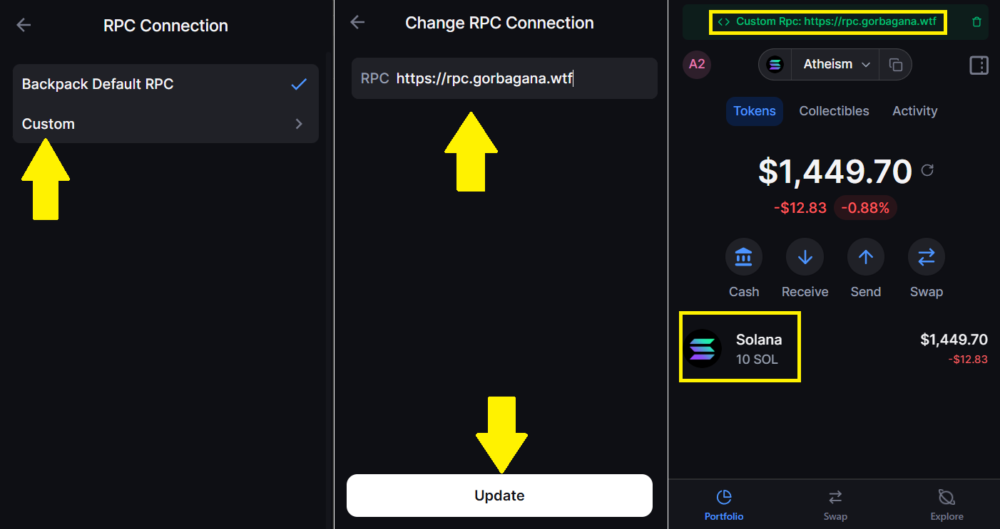

# Connecting to Testnet

Using Backpack Wallet with Gorbagana

Backpack is currently the primary supported wallet for accessing the Gorbagana network, more are to come as other teams update their wallet applications/extensions.

## Wallet Configuration

### Desktop access via web extension

#### Step 1: Download Backpack

* Visit [backpack.app](https://backpack.app/) to download the wallet

<figure><figcaption></figcaption></figure>

#### Step 2: Create/Import Solana Wallet

* Open Backpack and create a new Solana wallet or import a private key
  * **Note:** Make sure to backup your recovery phrase securely if not importing
* Your Solana wallet private key/secret phrase will be used to interact with Gorbagana

#### Step 3: Configure Custom RPC

1. Navigate to wallet settings by clicking the circle in the top left corner
2. Click settings and select 'Solana', then RPC Connection
3. Click 'Custom' and add the Gorbagana RPC endpoint: `https://rpc.gorbagana.wtf/`
4. Don't forget to click the update button at the bottom to save changes
5. Viewing your wallet, you will see this 'Customer RPC' at the top, letting you know you're accessing the Gorbagana testnet

<figure><figcaption></figcaption></figure>

<figure><figcaption></figcaption></figure>

* **Important:** On desktop Backpack extension, testnet $GOR will display as $SOL, but functions as gas for all transactions and applications on the Gorbagana network
* You can now interact with Gorbagana dApps and send transactions

## Mobile Configuration

### Mobile access via iOS/Android app

#### Step 1: Download Backpack

* Visit your app store and search `Backpack Wallet` to download the wallet

#### Step 2: Create/Import Solana Wallet

* Open Backpack and create a new Solana wallet or import a private key
  * **Note:** Make sure to backup your recovery phrase securely if not importing
* Your Solana wallet private key/secret phrase will be used to interact with Gorbagana

#### Step 3: Enable Gorbagana RPC

* Open the wallet list menu of the Backpack wallet by tapping the Solana icon in the top left
* Access the settings tab by tapping the cog in the top right
  * **Note:** You may need to click 'Refresh' when viewing Networks to see the Gorbagana network
* Once you see the Gorbagana network, tap the icon
* Select the wallet you would like to use this network with
* You will then see your available Gorbagana tokens in your wallet, here shown as native $GOR

<figure><figcaption></figcaption></figure>

## Security Reminder

Only use the official RPC endpoint: `https://rpc.gorbagana.wtf/` - never connect to unverified endpoints or suspicious websites.

## Need Help?

* Join the [official Telegram](https://t.me/+lw2vDTWJeacxMDhh) for community support
* Follow [@Gorbagana\_chain](https://x.com/Gorbagana_chain/) for wallet updates
* Report any connection issues to the development team
